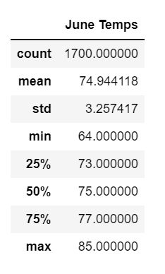
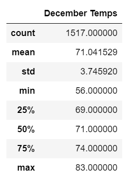

# Surfs-up-challenge
Surfs-up challenge using sqllite and Flask

## Overview of the Project:
Investing in Waves and Ice Cream:

Interested in opening a Surf and Shake shop which serves ice cream and surf boards to locals and tourists on the Oahu island.  Need to do some analysis on weather dataset on the Oahu island to ensure that the weather conditions on the island will not be a problem for this type of business. 
There needs to be enough rain to keep everything green, but not so much that you lose out on that ideal surfing and ice cream weather.

### Purpose:
Analyze temperature trends before opening the surf shop in order to determine if the surf and ice cream shop business is sustainable year-round.

- Analyze temperature data for the months of June in Oahu
- Analyze temperature data for the months of December in Oahu

## Resources: 

Software: SQLite database, Jupyter notebook, VS Code

## Results

For this Python analysis, [hawaii.sqlite](hawaii.sqlite) database was used to retrieve the temperatures for the month of June and December. SQLAlchemy was used to query the SQLite database.

Statistics on June Temperatures in Oahu:

Statistics on December Temperatures in Oahu:

- June temperature had more data points (1700) than December temperature (1517)
- Standard deviation of temperature in December is 3.74 whereas in June it is 3.25.  June standard deviation is closer to the average temperature for the month than December is.
- The minimum temperature in December was 56 degrees where as the minimum temperaturew in June was 64 degrees.
- Average temperature in December was 71 degrees where as the average temperature in June was 74 degrees.
- The maximum temperature in December was 83 degrees where as in June it was 85 degrees

## Summary

High Level Summary:

The statistics showed that the average temperature of December (71 degrees) is similar to the average temperature of June (73 degrees).  There is only a difference of 3 degrees in average temperature between the two months.

Similarly, the maximum temperature of December (83 degrees) is similar to the max temperature of June (85 degrees).  There is only a difference of 2 degrees in the max temperature between the two months.

The minimum temperature of December (56 degrees) is similar to the min temperature of June (64 degrees). Neither 56 degrees nor 64 degrees is ideal for ice creams and surf board. This point is concerning.

Two Additional Queries that can be performed to gather more weather data for June and December:

- What is the temperature on the days it rains in December and in June.  Or does it rain on the days it is warm in December and June.

- Find the most active stations and analyze the data from that station.
    

